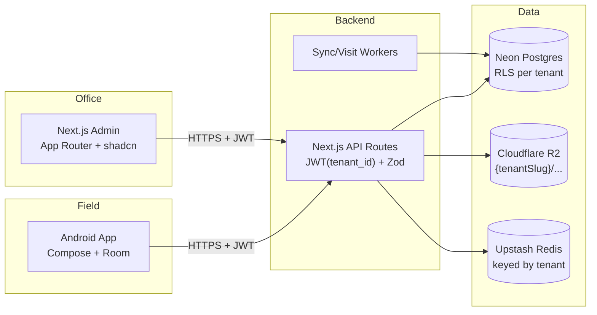

# VCTS Multi-Phase Build Plan

## Repo layout

```
/web          Next.js 14 (App Router) + Drizzle ORM + Neon
/android      Kotlin + Jetpack Compose + Hilt + Room + Retrofit + WorkManager
/docs         PRD + architecture notes
.env.example  (already present)
.env.local    (already present - Neon)
```

## Architecture (target)



## Multi-tenancy model (locked in Phase 1)

- **Isolation strategy:** Single Neon DB, shared schema, **row-level tenancy**. Every domain table carries a `tenant_id uuid NOT NULL` FK to `tenants.id`.
- **Defense in depth:** Postgres **Row-Level Security (RLS)** policies on every domain table. App connects with a least-privileged role; each request sets `SET LOCAL app.tenant_id = '<uuid>'` inside a transaction, RLS filters everything automatically. Even a buggy `WHERE` clause cannot leak across tenants.
- **Login UX (your choice):** email-routed. `POST /api/auth/login {email, password}` - server finds the user by email (which is **globally unique across all tenants**), derives `tenant_id`, signs a JWT containing `{sub, tenant_id, role}`. No tenant picker in UI.
- **Globally unique email:** enforced by a plain unique index on `users.email`. A person cannot belong to two tenants. If that ever needs to change, we migrate to a `memberships` join table (out of scope for now).
- **Storage paths:** Cloudflare R2 (single bucket, e.g. `vcts-prod`) with keys prefixed by tenant slug, e.g. `t/{tenantSlug}/receipts/{receiptNo}.pdf`, `t/{tenantSlug}/photos/{collectionId}.jpg`. Access via AWS SDK v3 against the R2 S3-compatible endpoint; uploads use presigned PUT URLs so the Android client writes directly to R2.
- **Rate limiting:** Upstash keys include tenant, e.g. `rl:{tenantId}:{agentId}:collections:1m`.
- **Receipt numbering:** sequential per `(tenant_id, agent_id, fiscal_year)` via a Postgres function + per-tenant sequence rows.
- **Audit trail:** one logical chain per tenant (HMAC chain keyed by `tenant_id`). No cross-tenant chain links.
- **Provisioning (for now):** seed-only. Two demo tenants inserted by the Phase 1 seed script (`acme` and `globex`) so you can prove isolation by logging in as users from each and confirming zero cross-visibility. A proper platform-admin console lands in **Phase 11**.

## UI/UX standards (cross-cutting, locked in Phase 2 for web and Phase 4 for Android)

**Aesthetic direction:** modern, sleek, low-noise. Enterprise-trust meets fintech polish - think Linear / Stripe / Vercel dashboards. Generous whitespace, sharp typography, subtle depth, purposeful motion.

### Web (Next.js)

- **Component library:** shadcn/ui (built on Radix Primitives) - fully themeable, copy-in components, no bundle bloat. Zero opinionated styling; we own the tokens.
- **Styling:** Tailwind CSS v4 with CSS-variable-driven design tokens. All colors, radii, spacing, and motion durations expressed as HSL/numeric CSS variables so dark/light swap is a one-line class change.
- **Typography:** `Geist Sans` (UI) + `Geist Mono` (numbers/receipt numbers) via `next/font` for zero layout shift.
- **Theming:**
  - `next-themes` for light / dark / system with no-flash hydration
  - Theme toggle in top-right of every authenticated layout; keyboard shortcut `Ctrl/Cmd+J`
  - Tokens defined once in `web/src/app/globals.css` under `:root` and `.dark`
  - Per-tenant accent color (from `tenants.settings.branding.accentHsl`) overrides the primary token at runtime; receipts + login page pick it up automatically
- **Motion library:** GSAP 3 via `@gsap/react`'s `useGSAP` hook (scoped cleanup, SSR-safe). Plugins: `ScrollTrigger` (free), `Flip` (free) for shared-element transitions. Framer Motion is NOT used - we standardize on GSAP to keep one mental model.
- **Motion rules:**
  - All animations respect `prefers-reduced-motion`; `gsap.matchMedia()` gates ornament animations off for users who opt out
  - Durations capped: micro (120ms), standard (240ms), emphasized (400ms). Easing uses `power2.out` for entrances, `power2.inOut` for transitions
  - Page-level entrances: staggered fade+rise on dashboard KPI cards, sidebar slide-in once per session
  - Interaction feedback: button press scale 0.97, toast slide-in, tab underline morph via Flip
  - Map view: pin drop animation, geofence circle pulse on hover, agent-pin trail reveal on movement replay
  - Receipt PDF preview: modal scale-in from the row that opened it (Flip)
  - No gratuitous parallax or infinite loops; motion must communicate state change
- **Data viz:** Recharts styled to match tokens; subtle grid, rounded bars, animated on mount via GSAP timeline wrappers
- **Tables:** TanStack Table v8 with sticky headers, zebra rows in light mode only, row hover lift 1px
- **Icons:** Lucide (tree-shaken)
- **Accessibility:** WCAG AA contrast in both themes, keyboard nav on every interactive, focus-visible rings using a dedicated ring token
- **Loading states:** skeleton shimmer (GSAP timeline on a gradient) - no spinners except for destructive actions

### Android (Kotlin/Compose)

- **Design system:** Material 3 with a custom `VctsTheme` wrapper. Light + dark `ColorScheme` defined in `ui/theme/Color.kt`; follows system by default, toggle in Settings.
- **Typography:** Inter (bundled TTF) for UI, JetBrains Mono for receipt numbers.
- **Shapes/elevation:** small-rounded (12dp) cards, 1dp border instead of heavy shadows to match web aesthetic.
- **Motion:** Compose's built-in `animate*AsState` + `AnimatedContent` + shared-element transitions (Compose 1.7+). No GSAP on Android (native equivalent is Compose animation APIs). Same three-tier duration cap as web.
- **Dynamic color (Android 12+):** opt-in per tenant setting; default off so brand stays consistent across devices.
- **Dark-mode-first fields:** the collection form is the primary field-work surface - both themes are first-class, but dark mode is tuned for low-light field use (OLED-friendly near-black surface).
- **Per-tenant accent:** same `tenants.settings.branding.accentHsl` mapped to `MaterialTheme.colorScheme.primary` at app start.

### Deliverables in Phase 2 (web design system foundation)

- `web/src/app/globals.css` with full token set for light + dark
- `web/src/lib/theme/` with `ThemeProvider`, `ThemeToggle`, and a token reference MDX page at `/_design` (dev-only)
- `web/src/lib/motion/gsap.ts` with a `useReducedMotionSafeGSAP` wrapper and preset timelines (fadeRise, staggerChildren, flipShared)
- shadcn components installed: button, input, card, dialog, dropdown-menu, sheet, table, badge, tooltip, toast (Sonner), skeleton, tabs, select, form, command (kbd palette)
- Reusable shells: `AppShell` (sidebar + top bar), `PageHeader`, `EmptyState`, `DataTable` - all animation-ready

### Deliverables in Phase 4 (Android theme foundation)

- `android/app/src/main/java/com/threefat/vcts/ui/theme/` with Color, Type, Shape, Theme
- Settings-screen theme toggle (System / Light / Dark) persisted in DataStore
- Splash-to-first-screen shared motion via `Activity` transition + Compose shared-element

---

## Phase 0 - Prerequisites (verified, ready to proceed)

| Item | Status |
| --- | --- |
| GCP project + billing | done |
| Maps SDK for Android key (`ANDROID_API_KEY`), restricted to `com.threefat.vcts` + debug SHA-1 | done |
| Maps JS + Static Maps + Geocoding key (`MAPS_API_KEY`), restricted to `project-jcsyq.vercel.app/*` + `localhost:3000/*` | done |
| Firebase project + Android app registered + `google-services.json` downloaded | done (file to be placed in `/android/app/` at Phase 4) |
| Crashlytics / Analytics SDK wiring | deferred to Phase 10 (project is enabled, SDK integration later) |
| Upstash Redis env vars (`UPSTASH_REDIS_*`) | done |
| Neon Postgres (`DATABASE_URL*`) | done |
| Cloudflare R2 bucket + API token (`R2_ACCOUNT_ID`, `R2_ACCESS_KEY_ID`, `R2_SECRET_ACCESS_KEY`, `R2_BUCKET`, `R2_PUBLIC_BASE_URL`) | deferred - needed at start of Phase 3 (receipts are first thing we upload) |
| Android Studio + JDK 17 | done |
| Company branding | placeholders will be auto-generated ("3FAT" wordmark SVG + dummy company block) at Phase 8 |
| `applicationId` = `com.threefat.vcts` | locked |
| Release keystore SHA-1 for prod Maps key | deferred to Phase 10 |

No outstanding blockers. We proceed to Phase 1.

---

## Phase 1 - Multi-tenant foundations (backend skeleton + auth)

**Goal:** A runnable Next.js app connected to Neon with multi-tenant schema + RLS, working email-routed JWT auth, and a seed that proves two tenants cannot see each other's data.

Key files we'll create:
- `web/package.json`, `web/next.config.mjs`, `web/tsconfig.json`
- `web/drizzle/schema.ts` - all tables below, each with `tenant_id` FK
- `web/drizzle/migrations/0000_init.sql` + `0001_rls_policies.sql` (RLS + roles)
- `web/src/lib/db.ts` - Drizzle client that wraps each request in `BEGIN; SET LOCAL app.tenant_id = ...; ... COMMIT`
- `web/src/lib/auth/jwt.ts` - RS256 sign/verify, keypair loaded from env
- `web/src/lib/auth/middleware.ts` - extracts JWT, sets `tenant_id` on request context
- `web/src/app/api/auth/login/route.ts`, `refresh/route.ts`
- `web/src/lib/audit.ts` - HMAC-chained writes keyed by tenant
- `web/src/scripts/seed.ts` - two demo tenants with users

Schema additions beyond the PRD:
- `tenants` table: `id uuid PK, slug text unique, name text, created_at, is_active bool, settings jsonb` (holds geofence defaults, sync frequency, notification rules, branding overrides)
- `tenant_id uuid NOT NULL` on: `users`, `customers`, `collections`, `collection_reversals`, `location_logs`, `audit_trail`, `sync_queue`
- `receipt_counters` table: `(tenant_id, agent_id, fiscal_year, next_seq)` for per-tenant sequential numbering
- `users.email` has a **global** unique index (drives email-routed login)
- All domain tables have a composite index starting with `tenant_id`

RLS setup (in `0001_rls_policies.sql`):
```sql
ALTER TABLE customers ENABLE ROW LEVEL SECURITY;
CREATE POLICY tenant_isolation ON customers
  USING (tenant_id = current_setting('app.tenant_id')::uuid);
-- same for all other domain tables; app role has no BYPASSRLS
```

Auth flow:
1. `POST /api/auth/login` with `{email, password}`
2. Server `SELECT tenant_id, id, role, password_hash FROM users WHERE email = $1` (no tenant context needed here - this is the one exception, queried as a privileged role)
3. On success, sign JWT `{sub: user_id, tid: tenant_id, role, exp}` + issue refresh token
4. All subsequent API calls: middleware verifies JWT, pulls `tid`, and opens a DB transaction with `SET LOCAL app.tenant_id = tid` before running any query

Seed data:
- Tenant A (`acme`): 1 super-admin (`admin@acme.test`), 1 manager, 2 agents, 5 customers
- Tenant B (`globex`): 1 super-admin (`admin@globex.test`), 1 agent, 3 customers

**Your test steps:**
1. `cd web && pnpm dev`
2. Login as `admin@acme.test` -> `GET /api/customers` returns only Acme's 5 customers
3. Login as `admin@globex.test` -> `GET /api/customers` returns only Globex's 3 customers
4. Take Acme's JWT and manually try to `GET /api/customers/{globex-customer-id}` -> 404 (RLS filters it out even if we get the query wrong in code)
5. Write 3 audit events, verify HMAC chain integrity via a small CLI script

---

## Phase 2 - Tenant-scoped web admin MVP (+ design system foundation)

**Goal:** Log into a sleek, dark/light admin portal with `admin@acme.test`, manage only Acme's agents + customers. Repeat with Globex, see no overlap. Full design system + motion primitives land here and every later phase reuses them.

Design system (see "UI/UX standards" section for full detail):
- Tailwind v4 + shadcn/ui + CSS-variable tokens in `globals.css` for light/dark
- `next-themes` with theme toggle in top bar and `Ctrl/Cmd+J` shortcut
- Geist Sans + Geist Mono via `next/font`
- GSAP 3 with `@gsap/react`; `useReducedMotionSafeGSAP` wrapper; preset timelines
- Per-tenant accent color token sourced from `tenants.settings.branding.accentHsl`
- `AppShell`, `PageHeader`, `EmptyState`, `DataTable` reusable shells with built-in entrance animations
- Token reference page at `/_design` (dev-only) for visual QA

Feature work on top of the design system:
- Login page (animated logo, subtle gradient background, respects reduced motion)
- Protected layout with sidebar slide-in, JWT stored in httpOnly cookie
- Tenant badge in top nav (shows `Acme` or `Globex`) sourced from JWT claim
- Agent management: list, create, deactivate, assign territory (all scoped to current tenant via RLS). Row entrance stagger via GSAP.
- Customer management: CRUD with Google Maps picker (using `MAPS_API_KEY`), radius slider 50-500m, Geocoding for address-to-pin. Modal uses Flip transition from the triggering row.
- Dashboard shell with KPI cards (empty data for now) - staggered count-up via GSAP on mount
- Zustand + TanStack Query wired up

**Acceptance test:**
1. Log in as Acme admin, toggle dark mode, reload - theme persists with no flash
2. Create an agent. Log in as Globex admin - that agent is invisible.
3. URL tampering: paste an Acme customer UUID into `/customers/{uuid}` while logged in as Globex -> 404.
4. Enable OS-level "Reduce motion" and confirm ornament animations are disabled while functional transitions remain.
5. Lighthouse a11y score >= 95 on login and dashboard in both themes.

---

## Phase 3 - Collections API + Immutable Ledger (tenant-aware)

**Goal:** Backend accepts a collection submission, validates geo-fence server-side, generates a tenant-scoped receipt number, writes an audit row in that tenant's chain.

- `POST /api/collections` with server-side Haversine geo-fence check against the *customer's* registered coordinates; customer lookup is already RLS-filtered so cross-tenant IDs return 404
- Rate limit key: `rl:{tenantId}:{agentId}:collections:1m`, 10/min per agent
- Idempotency on client UUID, unique index on `(tenant_id, client_uuid)`
- Receipt numbers formatted `{tenantSlug}/{agentCode}/{FY}/{seq}` e.g. `acme/A001/FY25/00042`
- `POST /api/collections/:id/reversal` (supervisor only within same tenant)
- `GET /api/collections/:id/receipt` returns a short-lived presigned R2 URL for key `t/{tenantSlug}/receipts/{receiptNo}.pdf` (PDF generated lazily if the object doesn't exist yet). Storage client in `web/src/lib/storage/r2.ts` wraps `@aws-sdk/client-s3` against the R2 endpoint `https://{R2_ACCOUNT_ID}.r2.cloudflarestorage.com`.
- **R2 credentials required at this phase.** Before coding Phase 3 you'll create a bucket in the Cloudflare dashboard, generate an R2 API token (scoped to that bucket with read + write), and paste the values into `.env.local`. I'll add the variable stubs to `.env.example` on day one of Phase 3.
- Audit chain tests: write rows in two tenants, confirm chains are independent and tamper-detection works per tenant

---

## Phase 4 - Android foundations (your first Android code)

**Goal:** An app that builds, runs on emulator, and logs you in against the real backend with `agent@acme.test`. I'll narrate every Android concept as we go.

- Create `android/` via Android Studio wizard (Empty Compose Activity, min SDK 26, target SDK 35, Kotlin DSL Gradle), `applicationId = com.threefat.vcts`
- Drop `google-services.json` into `/android/app/`; apply the plugin but defer Crashlytics/Analytics SDK init
- Set up Hilt DI, navigation-compose, Retrofit + OkHttp + kotlinx.serialization
- **Theme foundation (`ui/theme/`):** Material 3 `VctsTheme` with custom light + dark `ColorScheme`, Inter + JetBrains Mono typography, shape/elevation tokens matching the web aesthetic. Theme preference (System / Light / Dark) persisted in DataStore with a toggle on the Settings screen.
- **Motion primitives:** reusable `AnimatedCard`, `StaggeredList`, `SharedBoundsContainer` composables using Compose's animation APIs. Same three-tier duration cap as web (120 / 240 / 400 ms).
- **Secure storage:** refresh token in Android Keystore (hardware-backed EncryptedSharedPreferences); access token in memory only; also persist last-known `tenantSlug` + accent color from the login response for display
- **Certificate pinning** via OkHttp (pin to your Vercel cert SPKI)
- Login screen (Compose): email + password only, no tenant picker. Logo pulse on load, subtle gradient background in dark mode. On success, store tokens and show tenant name + accent in the top bar.
- Basic navigation: Login -> Dashboard (empty) -> Settings -> Logout, with shared-element transitions between list items and detail screens

**Cross-tenant safety on device:** on logout, wipe Room + EncryptedSharedPreferences entirely. On login with a different email, detect if `tenantId` in the new JWT differs from the cached one and hard-reset the local DB before proceeding. Prevents residue when a phone is shared between agents of different orgs.

**What you'll learn here:** Gradle, Compose basics, Hilt, how Retrofit maps JSON, the Android lifecycle, emulator vs physical device. I'll give you a 1-page cheat sheet at phase start.

---

## Phase 5 - Android collection flow (online-first first, offline added in P6)

**Goal:** Agent searches a customer, opens the collection form, GPS gate enforces geo-fence, submission hits the API, receipt shows.

- Room DB with `customers`, `collections`, `sync_queue` tables
- Customer list + search + detail (data cached in Room, hydrated from API)
- FusedLocationProviderClient wrapper; single-fix capture with accuracy threshold (warn if > 50m)
- Geo-fence gate composable: computes distance to customer's registered lat/lng, unlocks form if inside radius
- Collection form (all PRD fields, conditional cheque/UTR), confirmation dialog showing GPS + amount
- On-device PDF receipt preview using iText7 (template matches web version)

---

## Phase 6 - Offline-first sync engine

**Goal:** Airplane-mode test: submit 3 collections, turn Wi-Fi on, see all 3 sync and receipts become "Synced".

- All writes go to `sync_queue` with `status=PENDING` first; UI is optimistic
- WorkManager: `PeriodicWorkRequest` every 15 min (network-constrained) + `OneTimeWorkRequest` triggered by `ConnectivityManager.NetworkCallback`
- `POST /api/sync/push` with batch payload, idempotent on UUID, returns per-record result
- `GET /api/sync/pull` returns delta of customers + balances since last cursor
- Conflict resolution: server timestamp wins; >10% balance discrepancy -> supervisor queue row written server-side
- Offline Queue screen with retry + error details
- **SQLCipher** enabled on Room DB (256-bit AES, key derived via Keystore)

---

## Phase 6.1 - Post-Phase-6 hardening (assignment + queue policy)

Out-of-scope work that landed alongside Phase 6 because it surfaced during dogfooding the offline queue:

**Agent ↔ customer assignment is now load-bearing**

- `GET /api/customers`, `GET /api/customers/:id`, and `GET /api/sync/pull` filter to `assignedAgentId = current agent` for `role === "agent"`. Managers/admins/auditors keep tenant-wide visibility.
- `createCollectionInTx` now requires `customer.assignedAgentId === agentId` for agents. Previously a null `assignedAgentId` (unassigned customer) was treated as "anyone can collect"; that loophole is closed.
- Web `Customers` table shows an **Assigned agent** column; the create/edit dialog has an `Assigned agent` selector populated from `/api/agents`.
- Android customer list + detail render an "Assigned to you" label so the field agent has a constant visual confirmation that the store is theirs.

**Offline queue retry ceiling + discard**

- Workers now stop draining a row after `attempts >= 10` and `failed` rows are terminal (no longer pulled into `nextBatch`). This kills the "40 retries on a forbidden row" failure mode that was burning battery in the field.
- Offline-queue UI grows a **Discard from queue** action for any row that is `failed` or has hit the attempt ceiling. Discard removes both the queue entry and the optimistic local collection row so the agent's "outstanding pending" count drops to zero again.

---

## Phase 7 - Location logging + visit validation

**Goal:** Manager can replay an agent's day; tracker fixes corroborate every collection.

**Schema additions**

- `location_logs.client_uuid` for idempotent batch pushes; the `(tenant, agent, client_uuid)` unique index turns retries into no-ops.
- `customer_visits` table: derived rows of sustained-presence (agent inside fence ≥ `VISIT_MIN_DWELL_SECONDS`, default 180s) with `(tenant, agent, customer, started_at)` unique to keep the cron worker idempotent.
- Three new tunables on `env`: `VISIT_MIN_DWELL_SECONDS`, `VISIT_RECOMPUTE_LOOKBACK_MIN`, `VISIT_COLLECTION_TOLERANCE_MIN`; a new `CRON_SECRET` for Vercel-Cron auth.
- RLS update extends to `customer_visits`; `vcts_app` gets append-only privileges on `location_logs` (no DELETE / UPDATE - tracker fixes are facts).

**Backend endpoints**

- `POST /api/location-logs/batch` (agent-only). Up to 200 fixes per call, idempotent on `clientUuid`, returns `{ outcomes: [{clientUuid, status: "created" | "duplicate"}], counts }`.
- `GET /api/agents/:id/movement?day=YYYY-MM-DD[&tz=Asia/Kolkata]` (manager / super-admin / auditor). Returns the day's `location_logs` plus the `customer_visits` derived for that day. Paged out at 5000 fixes; the response includes a `truncated` flag.
- `GET|POST /api/cron/visits/recompute` - Vercel Cron entry point. Re-derives visits across all tenants, raises supervisor reviews for unverified collections. **Note:** schedule was downshifted from `*/15 * * * *` to `0 2 * * *` (daily at 02:00 UTC) once Vercel started enforcing the Hobby-tier "max one cron per day" policy. To compensate, `VISIT_RECOMPUTE_LOOKBACK_MIN` is bumped to `1440` in prod so each daily run scans the full previous 24 hours. Net effect: supervisor reviews for unverified collections land with up to ~24h delay until the project moves to a Vercel Pro plan and the schedule is restored to `*/15 * * * *`.
- Visit clustering algorithm: walk fixes in time order, mark each fix with the **closest** in-fence customer, emit a visit when the run length ≥ `minDwellSeconds`. Gaps > 12 min split runs (one missed tracker tick is tolerated).
- Cross-correlation: any collection whose `collected_at ± VISIT_COLLECTION_TOLERANCE_MIN` window has no `tracker`-source fix inside the customer's fence raises an `unverified_visit` row in `supervisor_reviews` and flips `collections.supervisor_review = true`.

**Android additions**

- New Room table `location_logs` (Room v3 migration). Single-flight upserts; pruning of synced rows older than 24 h to bound on-device storage.
- `LocationLoggerService` foreground service using `FusedLocationProviderClient` at 5-min cadence, `Priority.PRIORITY_BALANCED_POWER_ACCURACY`. Persistent notification doubles as a clear "tracking on" affordance for the agent.
- `LocationLoggerScheduler` is the single seam for enabling / disabling tracking + restoring it after process death (called from `Application.onCreate`).
- Background-location rationale dialog (Android 10+) launched right after the agent flips the dashboard switch; falls back to "Open settings" once the user has been prompted once.
- `LocationLogsPushDrainer` rides the existing `SyncWorker`. Drains FIFO in 100-row batches; both `created` and `duplicate` outcomes mark the row synced. Transport failures simply leave rows pending - no per-row error reconciliation needed.
- Dashboard `TrackingCard` shows toggle, last-fix timestamp (relative time), pending-fix count, and triggers the foreground / background permission flows in one gesture.
- `TenantDataWiper` clears `location_logs` on logout + tenant change so a swapped device never replays the previous agent's route.

**Manifest / OS plumbing**

- `FOREGROUND_SERVICE`, `FOREGROUND_SERVICE_LOCATION`, `POST_NOTIFICATIONS` permissions added.
- `<service android:foregroundServiceType="location" />` in the manifest so Android 14+ accepts the location-typed foreground promotion.
- Notification channel `vcts_active_duty` (low importance, no badge, silent) created at `Application.onCreate`.

**Phase 9 will pick up:** the web `Movement` page UI (polyline replay, day picker, visit timeline) and the supervisor-review queue UI; the data is already flowing.

---

## Phase 7.1 - Startup notification permission prompt

Surfaced during dogfooding: on Android 13+ the persistent active-duty notification stayed invisible because `POST_NOTIFICATIONS` is denied by default and we never asked for it. Going forward we'll have other channels too (sync errors, supervisor reviews, manager pings), so we want a single seam that keeps notifications enabled.

- `MainActivity.onStart()` (API 33+) now checks `POST_NOTIFICATIONS` and, if denied, launches the system request dialog via `registerForActivityResult(RequestPermission)`. Runs every time the activity comes to the foreground until granted, then no-ops.
- Pre-API-33 builds skip the check entirely (the permission doesn't exist).
- "Don't allow + Don't ask again" still requires the user to flip the toggle in system settings; we don't deep-link there yet, but the channel itself remains created so once they re-enable it, every queued notification (active duty + future) just works.

---

## Phase 8 - Receipt polish: sharing, photo, signature

**Goal:** Agent captures photo + signature, shares the receipt on WhatsApp in 2 taps. All artifacts stored under tenant-prefixed R2 keys.

- CameraX integration for customer-photo proof; direct upload from the device to R2 via a tenant-scoped presigned PUT URL (`t/{tenantSlug}/photos/{collectionId}.jpg`). Server issues the presigned URL; the binary never flows through the Next.js API, which keeps receipts cheap and avoids Vercel function payload limits.
- Custom Compose signature pad; export as PNG, same upload flow
- PDF generation updated to embed photo + signature + Static Map thumbnail
- Receipt header renders `tenants.settings.branding` (logo + legal block). Phase 1 will ship placeholder branding ("3FAT Demo Co." for Acme, "Globex Trading Ltd." for Globex) so we can see per-tenant branding working end-to-end.
- Share sheet: WhatsApp (deep link with pre-filled text + PDF), SMS (short link), Email (intent with attachment), Save to Downloads
- Online verification page at `/r/[tenantSlug]/[receiptNo]` (public read-only view with QR-code link embedded in PDF). Tenant slug in URL so each tenant gets a branded verification page and there are no ID collisions across tenants.

### What actually shipped in Phase 8

**Backend (Next.js)**

- New `web/src/lib/storage/r2.ts` helpers: `photoKey`, `signatureKey`, `brandingLogoKey`, `presignPutUrl`, `getObjectBytes`. Direct R2 PUT/GET stays out of the Vercel function path entirely.
- `POST /api/collections/{id}/attachments/presign` issues a tenant-prefixed PUT URL (`t/{slug}/photos/{collectionId}.jpg`) after verifying the agent owns the row. Whitelists `image/(jpeg|png|webp)` content types.
- `PATCH /api/collections/{id}/attachments` persists `photoUrl` / `signatureUrl` keys (NOT full URLs) on the row and writes a `collection.attached` audit event. Idempotent; calling twice with the same key is a no-op.
- New `web/src/lib/tenants/branding.ts` parses `tenants.settings.branding` (`legalName`, `address`, `gstin`, `phone`, `logoUrl`, `accentHsl`).
- `GET|PATCH /api/tenants/me` for super-admin branding edits and `POST /api/tenants/me/branding/logo/presign` for logo upload (lands at `t/{slug}/brand/logo.{ext}`). Both audit-logged.
- Receipt PDF renderer (`web/src/lib/receipts/pdf.ts`) now embeds photo, signature, static-map thumbnail, branding logo + legal block, and a QR code linking to the public verification URL. PDFs are re-rendered on every `GET /api/collections/{id}/receipt` request so attachments + branding stay fresh.
- `GET /r/[...path]` public verification page (no auth) renders branding header, collection metadata, photo + signature thumbnails (via short-lived presigned R2 reads), static map, and a QR code. Tenant slug is the leading path segment so URLs look like `/r/acme/A001/FY26/00042`.
- `GET /api/sync/pull` now ships `photoUrl` + `signatureUrl` on each `collections` row so devices that pull never overwrite their local attachment state.

**Web admin**

- New "Branding" sidebar entry (super-admin only) that edits legal name, address, GSTIN, phone, accent HSL, and uploads a logo via presigned R2 PUT. Lazy-draft form pattern keeps state in sync with server response without `setState-in-effect`.
- Customers, dashboard, and tenant menu picks up `legalNameFor(branding)` so the demo placeholders ("3FAT Demo Co." / "Globex Trading Ltd.") render even before super-admins customise their branding.

**Android**

- New Compose screens: `PhotoCaptureScreen` (CameraX preview, capture, lens flip, runtime CAMERA permission flow) and `SignaturePadScreen` (custom Canvas signature pad, clear, save → PNG export).
- `AttachmentsRepository` writes captured bytes to `cacheDir/{photos,signatures}/` and stamps the local path onto the row via `CollectionDao.updateLocalAttachmentPaths()`. Capture immediately calls `SyncScheduler.requestImmediate()` so a connected device uploads within seconds.
- New Room columns `photo_local_path` + `signature_local_path` (Room v3 → v4 migration). The domain model exposes `hasPendingAttachmentUpload` for UI state.
- `AttachmentsPushDrainer` runs after `CollectionsPushDrainer` inside `SyncRepository.syncOnce()`. Per-collection it: presigns → PUTs bytes via a dedicated `@R2UploadClient` OkHttpClient (no auth interceptor, no cert pinner; presigned URL carries its own auth) → PATCHes the collection. Permanent (4xx, except 408/429) failures clear the local pointer; transient failures retry next worker tick.
- `ReceiptPreviewScreen` grows a "Capture proof" card with photo + signature tiles (status: none / waiting to upload / uploaded), a WhatsApp share button, a generic share-sheet button, a "Save to device" button, and the existing Done button. Share text + subject pull `verifyUrl` from `BuildConfig.API_BASE_URL` and the receipt number, URL-encoded segment by segment to match the public route.
- `FileShare` exposes `shareReceiptPdf`, `shareReceiptToWhatsApp`, `saveReceiptToDownloads` and a manifest-declared `FileProvider` (`<package>.fileprovider`) over `cache/`, `files/Downloads/`, and the new `cache/{photos,signatures}/`.
- `build.gradle.kts` adds CameraX (core/camera2/lifecycle/view), Coil Compose, and ZXing core. `versionName` bumped to `0.8.0`.

**Limits / next-up**

- The on-device PDF renderer (`ReceiptPdfRenderer`) does NOT yet embed photo / signature / map / QR; the share sheet always shares the server-rendered PDF (which does embed everything). The on-device PDF stays as the offline-only fallback. Mirroring the web template is tracked for Phase 9.
- Photos are always uploaded as `image/jpeg`; HEIC capture isn't enabled (CameraX defaults to JPEG on all current devices we support).
- Background photo upload is gated on the row already having a server id (i.e. the collection has synced). If the agent captures a photo before the row syncs, the drainer skips it until the row rekeys from `clientUuid` to `id`.

---

## Phase 9 - Web: live map, movement replay, reports, audit viewer

**Goal:** Manager sees live agent pins, drills into a day's movement, exports reports, auditor reviews the chain.

- Server-Sent Events endpoint `/api/stream/agent-locations` for live pins
- Live map view with customer markers + geo-fence circles + agent pins
- Movement replay: day picker + polyline animation using `react-google-maps`
- Collections log table (TanStack Table) with GPS-verify badge, receipt preview, reversal action
- Customer ledger page with CSV/PDF export (jsPDF + XLSX)
- Audit trail viewer with chain-integrity status and export
- Reports: daily/weekly/monthly summaries (Recharts), agent performance

### What actually shipped in Phase 9

**New backend endpoints**

- `GET /api/reviews?status=pending|resolved|all` — joined view of `supervisor_reviews + collections + customers + users`. Restricted to manager / super-admin / auditor.
- `PATCH /api/reviews/{id}` — `{ action: "resolve" | "reopen", note? }`. Stamps `resolved_at` + `resolved_by`, re-derives `collections.supervisor_review` from "any open reviews remain?", and writes a `review.resolve` / `review.reopen` audit event.
- `GET /api/audit?cursor=<seq>&limit=&action=` — cursor-paginated read of `audit_trail` (RLS-scoped). Resolves actor names from the auth-only `users` table; never returns row HMACs.
- `GET /api/audit/verify` — runs `verifyChain()` over the entire tenant's chain and returns `{ ok, rows, brokenAtSeq?, reason? }`. Restricted to super-admin / auditor.
- `GET /api/reports/summary?from=&to=` — three SQL aggregates in one round-trip: `byDay` (UTC), `byAgent` (with names from `users`), `byMode`, plus tenant totals (count / amount / supervisorReview).

**New web pages**

- `/movement` — agent + day picker, Google Map with polyline (start/end pins), customer fence circles for the selected agent, plus a sidebar showing fix count, visit count, total on-site time, and a per-visit timeline (start/end times, dwell, "collected" vs "visit only" badge). Reuses the existing `GET /api/agents/:id/movement` API from Phase 7.
- `/reviews` — pending / resolved tabs over the new `/api/reviews` endpoint. Each card shows reason badge (balance-drift / stale-replay / unverified-visit), receipt + customer + agent + amount, raised time, and a Resolve / Reopen button gated to manager + super-admin. The flag payload is rendered as a collapsed JSON block for context.
- `/audit` — paginated table over `/api/audit` with cursor-based "Load more". Action filter (exact match), CSV export of the visible window, click a row to expand the before/after JSON diff, and a "Verify chain" button (super-admin / auditor) that surfaces the chain integrity card (ok / broken-at-seq / reason).
- `/reports` — date-range KPI cards (collections, recovered amount, flagged for review), `LineChart` of daily collections, `PieChart` of payment modes, and a horizontal `BarChart` of top-10 agents by amount. CSV export of the daily bucket. Recharts (`pnpm add recharts`) is the new dep.
- `/collections` (enhanced, not new) — text search across receipt no, customer, customer code, agent name + code; payment-mode filter; "all / flagged / clean" filter; GPS-verify badge (≤ 50 m accuracy = green check); supervisor-review badge column; CSV export of the filtered window.

**Other changes**

- `AppShell` sidebar grew Movement / Reports / Reviews / Audit entries and demoted Live map to "soon"; the Branding link moved below the manager surfaces.
- `AuthUser.role` widened to include `"auditor"` (the JWT layer already allowed it; the client store was the last hold-out).
- Lint + `tsc --noEmit` are clean across the whole web app; the only outstanding warning is the pre-existing `useReactTable()` "incompatible library" notice from React Compiler.

**What was deferred**

- The live-SSE pin map at `/map` and the matching `/api/stream/agent-locations` channel. The data is ready (Phase 7 already pushes batches every 5 minutes) and movement replay covers the manager use case for now; the live view is wired into Phase 10 alongside Crashlytics + Analytics so we don't ship a half-instrumented streaming endpoint.
- Customer-ledger CSV/PDF export. The collections log already exports CSV; the per-customer ledger is small enough that paging through it from the customer detail dialog is acceptable until somebody asks for it.

---

## Phase 10 - Hardening + release prep

**Goal:** Security audit passes, app is installable via APK (later Play Store).

Tracked in tracks rather than a single sweep. Track A first because everything else (device binding, release build, etc.) inherits its assumptions.

### Track A - Security audit (server) [completed]

- **Tenant-isolation verifier** at `web/src/scripts/verify-isolation.ts` (npm `verify:isolation`). Pure-HTTP test that logs in across both seeded tenants in admin + agent roles, then walks every UUID-bearing endpoint to assert: cross-tenant returns 404, cross-agent within tenant returns 403/404 (per route contract), agent-on-manager+ returns 403, anonymous + bad-token returns 401, cron without secret returns 401. Baseline: 46/46 passing on prod.
- **Rate limits extended** beyond the original collections bucket:
  - `loginIp` (`LOGIN_IP_RATE_PER_MIN`, default 20) and `loginEmail` (`LOGIN_EMAIL_RATE_PER_MIN`, default 5) on `POST /api/auth/login` to throttle credential stuffing.
  - `attachments` on `POST /api/collections/{id}/attachments/presign`.
  - `syncPush` on `POST /api/sync/push` (per-request, not per-record - the `MAX_BATCH=50` cap already constrains record volume).
  - `locationLogs` on `POST /api/location-logs/batch`.
  - `geocode` on `GET /api/geocode` (per tenant + user).
  - `tenantBranding` on `POST /api/tenants/me/branding/logo/presign`.
  All backed by Upstash Redis (sliding window) when KV env vars are present, with the existing in-memory dev fallback. Each rejection emits the standard `X-RateLimit-*` + `Retry-After` headers.
- **Input validation sweep:**
  - Login `password` capped at 256 chars to keep bcrypt safe from giant-string DoS; `email` capped at 254 (RFC 5321); `deviceId` capped at 128.
  - `/api/audit` query params switched to a Zod schema (`cursor.coerce.number().positive()`, `limit.min(1).max(500)`, `action.regex(/^[a-z0-9._-]{1,64}$/)`).
  - `/api/reviews` `status` validated as enum (`pending|resolved|all`).
  - `/api/collections` GET query (`customerId/agentId/from/to/limit`) all run through Zod with `coerce.date()` instead of raw `new Date(string)`, eliminating the silent Invalid-Date path.
  - Drizzle handles parameterised queries everywhere - manual audit confirmed (no string-concat SQL in the codebase).
- **Key rotation runbook** at `docs/runbooks/key-rotation.md`: per-secret instructions for `JWT_*`, `PASSWORD_PEPPER`, `AUDIT_HMAC_SECRET`, `APP_DB_PASSWORD`, `CRON_SECRET`, R2 keys, plus a force-logout SQL recipe and a post-rotation verification checklist.

### Track A.6 - Cross-tenant RLS regression [completed - postmortem]

**Symptom:** While verifying Track B against prod, the extended verifier surfaced 9 failures (`customers` + `collections` list overlap, every cross-tenant `/api/customers/{id}` and `/api/collections/{id}` route returning 200 / 201 / 500 instead of 404, and `/attachments` info-leaking via 403 instead of 404). Earlier 46/46 baseline had run against an environment where this wasn't visible.

**Root cause:** RLS had **never been enabled in production**. The `apply-rls.ts` script (`pnpm db:rls`) was missed during initial provisioning. Postgres remembered `FORCE ROW LEVEL SECURITY` (it's sticky across DISABLE) but `relrowsecurity=false` and zero `tenant_isolation` policies meant every cross-tenant query returned all rows. The `vcts_app` role had `bypassrls=false` correctly, but RLS-without-policies still admits everything. Confirmed via the new before/after diagnostic in `apply-rls.ts`:
```
customers              rls=false forced=true policies=0   (BEFORE)
customers              rls=true  forced=true policies=1   (AFTER)
```
Every other tenant-scoped table identical.

**Why the routes that did work, worked:** `/api/agents/[id]` and `/api/collections/[id]/receipt` happened to do a follow-up `withoutTenant` lookup explicitly filtered by `tenantId`, so the cross-tenant agent/tenant didn't match and the route returned 404 anyway. The customer/collection routes had no such fallback - they trusted RLS as the only filter.

**Two-track fix:**

1. **Restore RLS:** `pnpm db:rls` re-applied. The script now prints `=== RLS state BEFORE ===` and `=== RLS state AFTER ===` blocks (role bypassrls bit, every tenant table's `relrowsecurity` / `relforcerowsecurity` / policy count) so any future drift is immediately visible instead of silently leaking data.
2. **Defense in depth:** every `withTenant` query on a tenant-scoped table now AND's `eq(table.tenantId, auth.tid)` into its WHERE clause. Mirrors the agents-route pattern that has never failed. Touches `customers`, `collections`, `collection_reversals`, `supervisor_reviews`, `customer_visits`, `location_logs`, the public verification page, the `lib/visits/recompute.ts` cron worker, and the dashboard / reports aggregates so a misconfigured policy can never silently absorb cross-tenant rows into a KPI sum.

**Verifier hardening:** `verify-isolation.ts` extended with three new checks - `/sync/pull` customer overlap, `/sync/pull` collection overlap, and `/reports/summary` per-tenant scoping. Without these, the same regression would have stayed invisible on the offline-ingestion path. New baseline: **55/55 passing** against prod.

**Bootstrap rule (added to `docs/runbooks/key-rotation.md`):** first-time provisioning of a new prod DB requires `pnpm db:push && pnpm db:rls`, never one without the other. Schema-touching tracks must ship the migration in a separate commit *before* the code that uses the new column - we hit a related "deployed before migrated" outage on Track B that the new ordering rule prevents.

### Track B - Device binding [completed]

**Threat model:** an attacker who exfiltrates the encrypted refresh token from a stolen device must not be able to replay it from a different device. We bind each refresh-token row to a stable per-install UUID and reject mismatched refreshes.

- **Server:** `refresh_tokens.device_fingerprint TEXT NULL` (added; legacy rows stay null and skip the check during rollout). New helper `web/src/lib/auth/device-fingerprint.ts` exposes `InstallIdSchema` (8-128 chars, regex-tight) and `deviceFingerprint(installId)` = `sha256(installId)` hex. `POST /api/auth/login` accepts an optional `installId`, hashes it, persists the digest on the new refresh row, and embeds the same digest in the access token's `dfp` claim. `POST /api/auth/refresh` accepts `installId`; if the row carries a fingerprint, the request must include a matching `installId` or the row is best-effort revoked and the response is `401 { code: "device_mismatch" }`. Refreshing a legacy row without an `installId` keeps working until it rotates, at which point the new row inherits whatever fingerprint the client now supplies (auto-upgrade path). Schema change is a pure `ADD COLUMN` with no default - rolling out requires `pnpm db:push` against Neon, no data backfill.
- **JWT:** `AuthClaims.dfp?: string` (optional) so legacy access tokens stay shape-compatible. The claim is informational today; later phases can enforce it at the verifier if we want hard binding on every request.
- **Android:** `AppPreferences.getOrCreateInstallId()` lazily mints a UUID v4 on first read and persists it across logouts. `LoginRequest` and `RefreshRequest` DTOs gained an optional `installId` field; `AuthRepository.login()` and `TokenRefreshAuthenticator` both pull it from DataStore on every call. `clearSessionTraces()` keeps the install UUID intact (it identifies the *device*, not the user); only uninstall / Clear Data resets it.
- **Verifier:** `verify-isolation.ts` Section H exercises the matrix - login(installId A) + refresh(installId A) = 200, login(installId A) + refresh(installId B) = 401, login() + refresh() = 200 (legacy compat). Pre-deploy baseline against prod: 51/52 passing (the one failure is the bound-mismatch case, which is exactly what we want to start enforcing).

### Track C - Carry-over feature gaps

- C1 [completed]. Android on-device PDF rewritten to match the web template:
  - A4 portrait with the same accent header band (logo + tenant block + receipt no + UTC date), divider, two-column "Received from / Collected by" block, amount band (light bg + accent amount + mode + ref), GPS / cheque-date / remarks meta rows, three-slot attachments band (PHOTO + SIGNATURE + GPS PIN with "Not captured" placeholders), QR-code verify-link in the bottom-right, and the disclaimer + "VCTS" footer. Reversed receipts get a desaturated 60pt -25deg watermark.
  - New `data/receipt/ReceiptAssetsLoader.kt` resolves every binary input in parallel: prefers local files for photo + signature (recently captured), falls back to presigned R2 GETs the server hands out (re-renders post-drainer when the local cache has been cleared), proxies the static-map thumbnail through the new `/api/maps/static` endpoint so the Maps API key never ships in the APK, and renders the QR code via ZXing.
  - New web endpoint `GET /api/collections/{id}/receipt-assets` bundles tenant branding (legalName / address / gstin / phone), agent name + agentCode, the reversed flag, the public verify URL, and presigned GET URLs for photo / signature / logo into a single round-trip the device makes once per receipt-no flip.
  - New web endpoint `GET /api/maps/static` proxies Google Static Maps. Auth-protected, throttled via the existing `geocode` rate-limit bucket (per tenant + user), 24h public cache (the same lat/lng/zoom always renders the same tile).
  - `verify-isolation` Section C / D / F extended with three new checks (`receipt-assets` cross-tenant 404, same-tenant cross-agent 403, `/api/maps/static` anonymous 401) so the new surface stays covered by the verifier.
  - Fallback path: when the receipt-assets call is unreachable (offline) the renderer still produces a usable PDF using slug-derived branding, the local agent name from the session, and local files for any captured attachments.
- C2 [completed]. Live SSE map.
  - `GET /api/stream/agent-locations` is a Server-Sent Events channel that emits a `snapshot` event every 5s (or `heartbeat` if the snapshot is unchanged) for ~50s before closing - well below Vercel's `maxDuration=60` cap. The browser's `EventSource` auto-reconnects (we send `retry: 5000` upstream). Auth uses the existing `vcts_access` httpOnly cookie that login already sets, so the native `EventSource` constructor "just works" with no custom polyfill. Restricted to manager / super_admin / auditor; agents get 403.
  - `lib/agents/live-locations.ts` runs a single `DISTINCT ON (agent_id)` query against the `(tenant_id, agent_id, logged_at)` index for "latest fix per agent in the tenant within the last 30 minutes", then resolves agent display names + agentCode in a second `withoutTenant` round-trip (`users` table is auth-only). Defense in depth: explicit `tenant_id = $1` predicate alongside RLS.
  - `/map` page renders a Google Map with one `AdvancedMarker` per active agent. Pin colour fades primary -> amber -> grey as the fix ages past 2/10 minutes; an accuracy circle shows the GPS confidence; the sidebar lists each agent with last-seen + battery + accuracy. Map auto-fits when the agent set changes shape, but pure position updates leave the user's pan + zoom intact. Status pill above the header shows Connecting / Live / Reconnecting / Offline based on the EventSource state + a 30s staleness watchdog; a "Reconnect" button forcibly tears down + re-opens the stream.
  - AppShell sidebar promoted "Live map" from `comingSoon: true` to active.
  - `verify-isolation` extended with two more checks: anonymous `/api/stream/agent-locations` -> 401, agent role -> 403. Combined with the C1 additions the verifier baseline is now **60/60**.
- C3 [completed]. Customer-ledger CSV/PDF export on the customer detail page.
  - `GET /api/customers/{id}/ledger?format=json|csv|pdf` - one endpoint, three serialisations, all tenant-scoped through `withTenant` + the explicit `eq(customers.tenantId, auth.tid)` defense layer. Agents only see ledgers for customers assigned to them (same predicate as `/api/customers/{id}`); managers / admins / auditors see any customer in the tenant. Reversal joins are deduplicated server-side, agent display names resolved through a single `withoutTenant` round-trip (`users` table is auth-only), totals (count, gross, reversedCount/Amount, net) computed on the way out. CSV uses RFC 4180-style quoting; PDF uses pdf-lib for parity with the receipt path (no extra deps).
  - `lib/receipts/ledger-pdf.ts` - A4 portrait, accent stripe, tenant + customer header band with the outstanding-balance pulled to the right, then a tabular collection ledger that paginates automatically once it would overflow into the footer reserve. Reversed rows render in red with a `REV` chip on the amount column. Final page closes with a totals strip (Total Receipts / Gross / Reversed / Net) and a "Computer-generated ledger" footer.
  - `/customers` dialog gained a `LedgerExportActions` row in the footer: two `outline` buttons (CSV + PDF) that hit the new endpoint via `same-origin` fetch, push the response through `Blob` -> `download` (so we can surface server errors as toast instead of dumping JSON in a new tab). Hidden in `create` mode because there's no customer id yet.
  - `verify-isolation` extended with five more checks: cross-tenant 404 in JSON / CSV / PDF formats, agent reading a non-assigned customer's ledger -> 404, and an admin happy-path JSON shape sanity (`customer.id`, `collections[]`, `totals.count`, `totals.net`). Verifier baseline now **65/65**.

### Track D - Build & release prep [completed - in-repo items]

- **Crashlytics + Analytics wiring:** Android Gradle now applies `com.google.gms.google-services` and `com.google.firebase.crashlytics` only when `android/app/google-services.json` exists. Firebase Analytics + Crashlytics dependencies are gated the same way, keeping debug/clean-checkout builds usable while release machines get telemetry automatically. `BuildConfig.FIREBASE_ENABLED` records whether the Firebase config was present at build time.
- **TLS cert pinning:** release builds no longer use the dummy `sha256/AAAA...` pin. `API_CERT_PINS` now contains the SPKI hashes observed on 2026-05-10 for `project-jcsyq.vercel.app`: current `*.vercel.app` leaf, Google Trust Services WR1 intermediate, and GTS Root R1 backup. Debug builds remain unpinned for local proxying.
- **Release signing guard:** `assembleRelease` now depends on `validateReleaseInputs`, which fails fast unless `android/app/google-services.json` and all four env vars are present: `VCTS_RELEASE_STORE_FILE`, `VCTS_RELEASE_STORE_PASSWORD`, `VCTS_RELEASE_KEY_ALIAS`, `VCTS_RELEASE_KEY_PASSWORD`. This prevents accidental unsigned/no-telemetry release artifacts.
- **ProGuard/R8 hardening:** `android/app/proguard-rules.pro` expanded from minimal Hilt/serialization rules to cover kotlinx-serialization companions, Retrofit annotations, OkHttp/Okio service lookup, Room/WorkManager/Hilt workers, SQLCipher JNI, PDFBox-Android optional desktop APIs, Firebase Crashlytics/Analytics, CameraX, and Coil. This is deliberately conservative for the first shrinked release.
- **Runbooks:** added `docs/runbooks/android-release.md` (Firebase config, signing env, SHA-1 extraction, TLS pin rotation, build/internal-test checklist) and `docs/runbooks/neon-backup-restore.md` (routine `pg_dump`, Neon PITR/branch restore, full `pg_restore`, mandatory `pnpm db:rls`, verifier baseline, audit-chain check, RLS failure-mode reminder).
- **Photo upload antivirus:** not implemented in code for Phase 10. Decision: defer until real upload volume justifies the operational complexity; candidate designs remain ClamAV Lambda/S3-style scanner or a Vercel-side MIME/content validation layer before accepting attachment metadata.
- **External console steps moved to final release phase:** the local `android/app/google-services.json` is already gitignored and should stay uncommitted. Actual signed APK/AAB generation, release keystore handling, release SHA-1 API-key restriction, and Play Console internal testing are deferred to the final release phase.

---

## Final Release Phase - Signed Android + Production Rollout

**Goal:** turn the release-prepped codebase into distributable production artifacts.

- Build the signed Android release APK/AAB from a Gradle-enabled machine with `android/app/google-services.json` present and `VCTS_RELEASE_*` env vars set.
- Add the release keystore SHA-1 + package `com.threefat.vcts` to the restricted Android Google API key in GCP.
- Upload to Play Console internal testing, verify install from Play, and confirm Crashlytics/Analytics sessions appear.
- Run final production smoke tests: `pnpm verify:isolation`, web admin flows, Android login/offline sync/location tracking/photo-signature/receipt share, and customer ledger exports.
- Take a Neon backup immediately before public rollout using `docs/runbooks/neon-backup-restore.md`.

---

## Phase 11 - Platform admin console + self-serve tenant provisioning

**Goal:** Stop relying on SQL seeds to create tenants. (Build this only after Phase 10 ships.)

- New `platform_admin` role, stored outside the tenant model (rows in `tenants` table won't help - we'll have a separate `platform_users` table)
- Hidden `/platform` route, protected by different JWT audience; lists tenants, create/suspend/delete
- Optional: self-serve signup flow at `/signup` - email verification, creates new tenant + super-admin user in one transaction, seeds default settings
- Tenant-level settings editor (geofence defaults, sync frequency, branding upload to R2 at `t/{slug}/brand/logo.png`)
- Usage metrics per tenant (collections/month, agents active, storage used) for future billing hook

---

## How we'll work each phase

1. I'll post a short "what we're building + what you'll learn" note at phase start
2. I make the code changes
3. I give you exact commands to test it (both on web and on the Android emulator), including what "success" looks like
4. You tell me pass/fail; we iterate; then we move to the next phase

## Decisions baked in (push back if you disagree)

- **ORM:** Drizzle (lighter than Prisma, great TS types, works well with Neon serverless driver, easy to issue `SET LOCAL` inside a transaction for RLS)
- **Auth:** Custom JWT (RS256) shared by web + mobile, **not** NextAuth - simpler for a mobile client and matches the PRD contract
- **Tenancy:** Row-level with `tenant_id` + Postgres RLS. One Neon DB, shared schema. Email-routed login.
- **Validation:** Zod on server, kotlinx.serialization + manual guards on Android
- **Payment mode enum + receipt numbering** live in DB, not code, so you can extend without redeploy
- **Redis (Upstash)** for rate limiting + session cache - all keys prefixed with tenant ID
- **UI stack:** Tailwind v4 + shadcn/ui + CSS-variable tokens + `next-themes` (light/dark/system). **GSAP 3** as the single animation library on web (no Framer Motion). Compose built-in animation APIs on Android. All motion respects `prefers-reduced-motion`.
