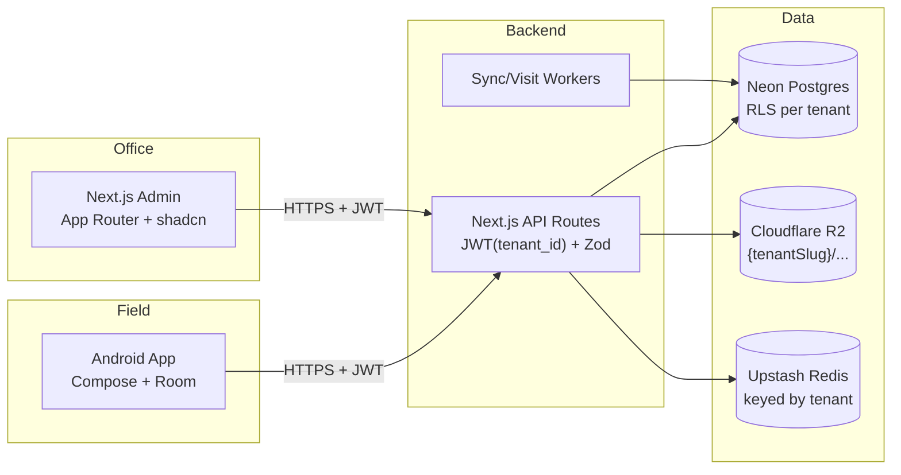

# VCTS Multi-Phase Build Plan

## Repo layout

```
/web          Next.js 14 (App Router) + Drizzle ORM + Neon
/android      Kotlin + Jetpack Compose + Hilt + Room + Retrofit + WorkManager
/docs         PRD + architecture notes
.env.example  (already present)
.env.local    (already present - Neon)
```

## Architecture (target)



## Multi-tenancy model (locked in Phase 1)

- **Isolation strategy:** Single Neon DB, shared schema, **row-level tenancy**. Every domain table carries a `tenant_id uuid NOT NULL` FK to `tenants.id`.
- **Defense in depth:** Postgres **Row-Level Security (RLS)** policies on every domain table. App connects with a least-privileged role; each request sets `SET LOCAL app.tenant_id = '<uuid>'` inside a transaction, RLS filters everything automatically. Even a buggy `WHERE` clause cannot leak across tenants.
- **Login UX (your choice):** email-routed. `POST /api/auth/login {email, password}` - server finds the user by email (which is **globally unique across all tenants**), derives `tenant_id`, signs a JWT containing `{sub, tenant_id, role}`. No tenant picker in UI.
- **Globally unique email:** enforced by a plain unique index on `users.email`. A person cannot belong to two tenants. If that ever needs to change, we migrate to a `memberships` join table (out of scope for now).
- **Storage paths:** Cloudflare R2 (single bucket, e.g. `vcts-prod`) with keys prefixed by tenant slug, e.g. `t/{tenantSlug}/receipts/{receiptNo}.pdf`, `t/{tenantSlug}/photos/{collectionId}.jpg`. Access via AWS SDK v3 against the R2 S3-compatible endpoint; uploads use presigned PUT URLs so the Android client writes directly to R2.
- **Rate limiting:** Upstash keys include tenant, e.g. `rl:{tenantId}:{agentId}:collections:1m`.
- **Receipt numbering:** sequential per `(tenant_id, agent_id, fiscal_year)` via a Postgres function + per-tenant sequence rows.
- **Audit trail:** one logical chain per tenant (HMAC chain keyed by `tenant_id`). No cross-tenant chain links.
- **Provisioning (for now):** seed-only. Two demo tenants inserted by the Phase 1 seed script (`acme` and `globex`) so you can prove isolation by logging in as users from each and confirming zero cross-visibility. A proper platform-admin console lands in **Phase 11**.

## UI/UX standards (cross-cutting, locked in Phase 2 for web and Phase 4 for Android)

**Aesthetic direction:** modern, sleek, low-noise. Enterprise-trust meets fintech polish - think Linear / Stripe / Vercel dashboards. Generous whitespace, sharp typography, subtle depth, purposeful motion.

### Web (Next.js)

- **Component library:** shadcn/ui (built on Radix Primitives) - fully themeable, copy-in components, no bundle bloat. Zero opinionated styling; we own the tokens.
- **Styling:** Tailwind CSS v4 with CSS-variable-driven design tokens. All colors, radii, spacing, and motion durations expressed as HSL/numeric CSS variables so dark/light swap is a one-line class change.
- **Typography:** `Geist Sans` (UI) + `Geist Mono` (numbers/receipt numbers) via `next/font` for zero layout shift.
- **Theming:**
  - `next-themes` for light / dark / system with no-flash hydration
  - Theme toggle in top-right of every authenticated layout; keyboard shortcut `Ctrl/Cmd+J`
  - Tokens defined once in `web/src/app/globals.css` under `:root` and `.dark`
  - Per-tenant accent color (from `tenants.settings.branding.accentHsl`) overrides the primary token at runtime; receipts + login page pick it up automatically
- **Motion library:** GSAP 3 via `@gsap/react`'s `useGSAP` hook (scoped cleanup, SSR-safe). Plugins: `ScrollTrigger` (free), `Flip` (free) for shared-element transitions. Framer Motion is NOT used - we standardize on GSAP to keep one mental model.
- **Motion rules:**
  - All animations respect `prefers-reduced-motion`; `gsap.matchMedia()` gates ornament animations off for users who opt out
  - Durations capped: micro (120ms), standard (240ms), emphasized (400ms). Easing uses `power2.out` for entrances, `power2.inOut` for transitions
  - Page-level entrances: staggered fade+rise on dashboard KPI cards, sidebar slide-in once per session
  - Interaction feedback: button press scale 0.97, toast slide-in, tab underline morph via Flip
  - Map view: pin drop animation, geofence circle pulse on hover, agent-pin trail reveal on movement replay
  - Receipt PDF preview: modal scale-in from the row that opened it (Flip)
  - No gratuitous parallax or infinite loops; motion must communicate state change
- **Data viz:** Recharts styled to match tokens; subtle grid, rounded bars, animated on mount via GSAP timeline wrappers
- **Tables:** TanStack Table v8 with sticky headers, zebra rows in light mode only, row hover lift 1px
- **Icons:** Lucide (tree-shaken)
- **Accessibility:** WCAG AA contrast in both themes, keyboard nav on every interactive, focus-visible rings using a dedicated ring token
- **Loading states:** skeleton shimmer (GSAP timeline on a gradient) - no spinners except for destructive actions

### Android (Kotlin/Compose)

- **Design system:** Material 3 with a custom `VctsTheme` wrapper. Light + dark `ColorScheme` defined in `ui/theme/Color.kt`; follows system by default, toggle in Settings.
- **Typography:** Inter (bundled TTF) for UI, JetBrains Mono for receipt numbers.
- **Shapes/elevation:** small-rounded (12dp) cards, 1dp border instead of heavy shadows to match web aesthetic.
- **Motion:** Compose's built-in `animate*AsState` + `AnimatedContent` + shared-element transitions (Compose 1.7+). No GSAP on Android (native equivalent is Compose animation APIs). Same three-tier duration cap as web.
- **Dynamic color (Android 12+):** opt-in per tenant setting; default off so brand stays consistent across devices.
- **Dark-mode-first fields:** the collection form is the primary field-work surface - both themes are first-class, but dark mode is tuned for low-light field use (OLED-friendly near-black surface).
- **Per-tenant accent:** same `tenants.settings.branding.accentHsl` mapped to `MaterialTheme.colorScheme.primary` at app start.

### Deliverables in Phase 2 (web design system foundation)

- `web/src/app/globals.css` with full token set for light + dark
- `web/src/lib/theme/` with `ThemeProvider`, `ThemeToggle`, and a token reference MDX page at `/_design` (dev-only)
- `web/src/lib/motion/gsap.ts` with a `useReducedMotionSafeGSAP` wrapper and preset timelines (fadeRise, staggerChildren, flipShared)
- shadcn components installed: button, input, card, dialog, dropdown-menu, sheet, table, badge, tooltip, toast (Sonner), skeleton, tabs, select, form, command (kbd palette)
- Reusable shells: `AppShell` (sidebar + top bar), `PageHeader`, `EmptyState`, `DataTable` - all animation-ready

### Deliverables in Phase 4 (Android theme foundation)

- `android/app/src/main/java/com/threefat/vcts/ui/theme/` with Color, Type, Shape, Theme
- Settings-screen theme toggle (System / Light / Dark) persisted in DataStore
- Splash-to-first-screen shared motion via `Activity` transition + Compose shared-element

---

## Phase 0 - Prerequisites (verified, ready to proceed)

| Item | Status |
| --- | --- |
| GCP project + billing | done |
| Maps SDK for Android key (`ANDROID_API_KEY`), restricted to `com.threefat.vcts` + debug SHA-1 | done |
| Maps JS + Static Maps + Geocoding key (`MAPS_API_KEY`), restricted to `project-jcsyq.vercel.app/*` + `localhost:3000/*` | done |
| Firebase project + Android app registered + `google-services.json` downloaded | done (file to be placed in `/android/app/` at Phase 4) |
| Crashlytics / Analytics SDK wiring | deferred to Phase 10 (project is enabled, SDK integration later) |
| Upstash Redis env vars (`UPSTASH_REDIS_*`) | done |
| Neon Postgres (`DATABASE_URL*`) | done |
| Cloudflare R2 bucket + API token (`R2_ACCOUNT_ID`, `R2_ACCESS_KEY_ID`, `R2_SECRET_ACCESS_KEY`, `R2_BUCKET`, `R2_PUBLIC_BASE_URL`) | deferred - needed at start of Phase 3 (receipts are first thing we upload) |
| Android Studio + JDK 17 | done |
| Company branding | placeholders will be auto-generated ("3FAT" wordmark SVG + dummy company block) at Phase 8 |
| `applicationId` = `com.threefat.vcts` | locked |
| Release keystore SHA-1 for prod Maps key | deferred to Phase 10 |

No outstanding blockers. We proceed to Phase 1.

---

## Phase 1 - Multi-tenant foundations (backend skeleton + auth)

**Goal:** A runnable Next.js app connected to Neon with multi-tenant schema + RLS, working email-routed JWT auth, and a seed that proves two tenants cannot see each other's data.

Key files we'll create:
- `web/package.json`, `web/next.config.mjs`, `web/tsconfig.json`
- `web/drizzle/schema.ts` - all tables below, each with `tenant_id` FK
- `web/drizzle/migrations/0000_init.sql` + `0001_rls_policies.sql` (RLS + roles)
- `web/src/lib/db.ts` - Drizzle client that wraps each request in `BEGIN; SET LOCAL app.tenant_id = ...; ... COMMIT`
- `web/src/lib/auth/jwt.ts` - RS256 sign/verify, keypair loaded from env
- `web/src/lib/auth/middleware.ts` - extracts JWT, sets `tenant_id` on request context
- `web/src/app/api/auth/login/route.ts`, `refresh/route.ts`
- `web/src/lib/audit.ts` - HMAC-chained writes keyed by tenant
- `web/src/scripts/seed.ts` - two demo tenants with users

Schema additions beyond the PRD:
- `tenants` table: `id uuid PK, slug text unique, name text, created_at, is_active bool, settings jsonb` (holds geofence defaults, sync frequency, notification rules, branding overrides)
- `tenant_id uuid NOT NULL` on: `users`, `customers`, `collections`, `collection_reversals`, `location_logs`, `audit_trail`, `sync_queue`
- `receipt_counters` table: `(tenant_id, agent_id, fiscal_year, next_seq)` for per-tenant sequential numbering
- `users.email` has a **global** unique index (drives email-routed login)
- All domain tables have a composite index starting with `tenant_id`

RLS setup (in `0001_rls_policies.sql`):
```sql
ALTER TABLE customers ENABLE ROW LEVEL SECURITY;
CREATE POLICY tenant_isolation ON customers
  USING (tenant_id = current_setting('app.tenant_id')::uuid);
-- same for all other domain tables; app role has no BYPASSRLS
```

Auth flow:
1. `POST /api/auth/login` with `{email, password}`
2. Server `SELECT tenant_id, id, role, password_hash FROM users WHERE email = $1` (no tenant context needed here - this is the one exception, queried as a privileged role)
3. On success, sign JWT `{sub: user_id, tid: tenant_id, role, exp}` + issue refresh token
4. All subsequent API calls: middleware verifies JWT, pulls `tid`, and opens a DB transaction with `SET LOCAL app.tenant_id = tid` before running any query

Seed data:
- Tenant A (`acme`): 1 super-admin (`admin@acme.test`), 1 manager, 2 agents, 5 customers
- Tenant B (`globex`): 1 super-admin (`admin@globex.test`), 1 agent, 3 customers

**Your test steps:**
1. `cd web && pnpm dev`
2. Login as `admin@acme.test` -> `GET /api/customers` returns only Acme's 5 customers
3. Login as `admin@globex.test` -> `GET /api/customers` returns only Globex's 3 customers
4. Take Acme's JWT and manually try to `GET /api/customers/{globex-customer-id}` -> 404 (RLS filters it out even if we get the query wrong in code)
5. Write 3 audit events, verify HMAC chain integrity via a small CLI script

---

## Phase 2 - Tenant-scoped web admin MVP (+ design system foundation)

**Goal:** Log into a sleek, dark/light admin portal with `admin@acme.test`, manage only Acme's agents + customers. Repeat with Globex, see no overlap. Full design system + motion primitives land here and every later phase reuses them.

Design system (see "UI/UX standards" section for full detail):
- Tailwind v4 + shadcn/ui + CSS-variable tokens in `globals.css` for light/dark
- `next-themes` with theme toggle in top bar and `Ctrl/Cmd+J` shortcut
- Geist Sans + Geist Mono via `next/font`
- GSAP 3 with `@gsap/react`; `useReducedMotionSafeGSAP` wrapper; preset timelines
- Per-tenant accent color token sourced from `tenants.settings.branding.accentHsl`
- `AppShell`, `PageHeader`, `EmptyState`, `DataTable` reusable shells with built-in entrance animations
- Token reference page at `/_design` (dev-only) for visual QA

Feature work on top of the design system:
- Login page (animated logo, subtle gradient background, respects reduced motion)
- Protected layout with sidebar slide-in, JWT stored in httpOnly cookie
- Tenant badge in top nav (shows `Acme` or `Globex`) sourced from JWT claim
- Agent management: list, create, deactivate, assign territory (all scoped to current tenant via RLS). Row entrance stagger via GSAP.
- Customer management: CRUD with Google Maps picker (using `MAPS_API_KEY`), radius slider 50-500m, Geocoding for address-to-pin. Modal uses Flip transition from the triggering row.
- Dashboard shell with KPI cards (empty data for now) - staggered count-up via GSAP on mount
- Zustand + TanStack Query wired up

**Acceptance test:**
1. Log in as Acme admin, toggle dark mode, reload - theme persists with no flash
2. Create an agent. Log in as Globex admin - that agent is invisible.
3. URL tampering: paste an Acme customer UUID into `/customers/{uuid}` while logged in as Globex -> 404.
4. Enable OS-level "Reduce motion" and confirm ornament animations are disabled while functional transitions remain.
5. Lighthouse a11y score >= 95 on login and dashboard in both themes.

---

## Phase 3 - Collections API + Immutable Ledger (tenant-aware)

**Goal:** Backend accepts a collection submission, validates geo-fence server-side, generates a tenant-scoped receipt number, writes an audit row in that tenant's chain.

- `POST /api/collections` with server-side Haversine geo-fence check against the *customer's* registered coordinates; customer lookup is already RLS-filtered so cross-tenant IDs return 404
- Rate limit key: `rl:{tenantId}:{agentId}:collections:1m`, 10/min per agent
- Idempotency on client UUID, unique index on `(tenant_id, client_uuid)`
- Receipt numbers formatted `{tenantSlug}/{agentCode}/{FY}/{seq}` e.g. `acme/A001/FY25/00042`
- `POST /api/collections/:id/reversal` (supervisor only within same tenant)
- `GET /api/collections/:id/receipt` returns a short-lived presigned R2 URL for key `t/{tenantSlug}/receipts/{receiptNo}.pdf` (PDF generated lazily if the object doesn't exist yet). Storage client in `web/src/lib/storage/r2.ts` wraps `@aws-sdk/client-s3` against the R2 endpoint `https://{R2_ACCOUNT_ID}.r2.cloudflarestorage.com`.
- **R2 credentials required at this phase.** Before coding Phase 3 you'll create a bucket in the Cloudflare dashboard, generate an R2 API token (scoped to that bucket with read + write), and paste the values into `.env.local`. I'll add the variable stubs to `.env.example` on day one of Phase 3.
- Audit chain tests: write rows in two tenants, confirm chains are independent and tamper-detection works per tenant

---

## Phase 4 - Android foundations (your first Android code)

**Goal:** An app that builds, runs on emulator, and logs you in against the real backend with `agent@acme.test`. I'll narrate every Android concept as we go.

- Create `android/` via Android Studio wizard (Empty Compose Activity, min SDK 26, target SDK 35, Kotlin DSL Gradle), `applicationId = com.threefat.vcts`
- Drop `google-services.json` into `/android/app/`; apply the plugin but defer Crashlytics/Analytics SDK init
- Set up Hilt DI, navigation-compose, Retrofit + OkHttp + kotlinx.serialization
- **Theme foundation (`ui/theme/`):** Material 3 `VctsTheme` with custom light + dark `ColorScheme`, Inter + JetBrains Mono typography, shape/elevation tokens matching the web aesthetic. Theme preference (System / Light / Dark) persisted in DataStore with a toggle on the Settings screen.
- **Motion primitives:** reusable `AnimatedCard`, `StaggeredList`, `SharedBoundsContainer` composables using Compose's animation APIs. Same three-tier duration cap as web (120 / 240 / 400 ms).
- **Secure storage:** refresh token in Android Keystore (hardware-backed EncryptedSharedPreferences); access token in memory only; also persist last-known `tenantSlug` + accent color from the login response for display
- **Certificate pinning** via OkHttp (pin to your Vercel cert SPKI)
- Login screen (Compose): email + password only, no tenant picker. Logo pulse on load, subtle gradient background in dark mode. On success, store tokens and show tenant name + accent in the top bar.
- Basic navigation: Login -> Dashboard (empty) -> Settings -> Logout, with shared-element transitions between list items and detail screens

**Cross-tenant safety on device:** on logout, wipe Room + EncryptedSharedPreferences entirely. On login with a different email, detect if `tenantId` in the new JWT differs from the cached one and hard-reset the local DB before proceeding. Prevents residue when a phone is shared between agents of different orgs.

**What you'll learn here:** Gradle, Compose basics, Hilt, how Retrofit maps JSON, the Android lifecycle, emulator vs physical device. I'll give you a 1-page cheat sheet at phase start.

---

## Phase 5 - Android collection flow (online-first first, offline added in P6)

**Goal:** Agent searches a customer, opens the collection form, GPS gate enforces geo-fence, submission hits the API, receipt shows.

- Room DB with `customers`, `collections`, `sync_queue` tables
- Customer list + search + detail (data cached in Room, hydrated from API)
- FusedLocationProviderClient wrapper; single-fix capture with accuracy threshold (warn if > 50m)
- Geo-fence gate composable: computes distance to customer's registered lat/lng, unlocks form if inside radius
- Collection form (all PRD fields, conditional cheque/UTR), confirmation dialog showing GPS + amount
- On-device PDF receipt preview using iText7 (template matches web version)

---

## Phase 6 - Offline-first sync engine

**Goal:** Airplane-mode test: submit 3 collections, turn Wi-Fi on, see all 3 sync and receipts become "Synced".

- All writes go to `sync_queue` with `status=PENDING` first; UI is optimistic
- WorkManager: `PeriodicWorkRequest` every 15 min (network-constrained) + `OneTimeWorkRequest` triggered by `ConnectivityManager.NetworkCallback`
- `POST /api/sync/push` with batch payload, idempotent on UUID, returns per-record result
- `GET /api/sync/pull` returns delta of customers + balances since last cursor
- Conflict resolution: server timestamp wins; >10% balance discrepancy -> supervisor queue row written server-side
- Offline Queue screen with retry + error details
- **SQLCipher** enabled on Room DB (256-bit AES, key derived via Keystore)

---

## Phase 7 - Location logging + visit validation

**Goal:** Manager can replay an agent's day on the web map.

- Foreground service with 5-minute location updates while app is active; batched to local Room table
- `POST /api/location-logs/batch` sync in same WorkManager job as Phase 6
- Background-location permission UX flow (Android 10+ rationale screen)
- Server-side visit-validation worker (Node cron via Vercel Cron): correlates `location_logs` with `customers`, marks visits where agent was inside fence >= 3 min
- Flag collections whose GPS is outside any customer fence -> `supervisor_review` flag

---

## Phase 8 - Receipt polish: sharing, photo, signature

**Goal:** Agent captures photo + signature, shares the receipt on WhatsApp in 2 taps. All artifacts stored under tenant-prefixed R2 keys.

- CameraX integration for customer-photo proof; direct upload from the device to R2 via a tenant-scoped presigned PUT URL (`t/{tenantSlug}/photos/{collectionId}.jpg`). Server issues the presigned URL; the binary never flows through the Next.js API, which keeps receipts cheap and avoids Vercel function payload limits.
- Custom Compose signature pad; export as PNG, same upload flow
- PDF generation updated to embed photo + signature + Static Map thumbnail
- Receipt header renders `tenants.settings.branding` (logo + legal block). Phase 1 will ship placeholder branding ("3FAT Demo Co." for Acme, "Globex Trading Ltd." for Globex) so we can see per-tenant branding working end-to-end.
- Share sheet: WhatsApp (deep link with pre-filled text + PDF), SMS (short link), Email (intent with attachment), Save to Downloads
- Online verification page at `/r/[tenantSlug]/[receiptNo]` (public read-only view with QR-code link embedded in PDF). Tenant slug in URL so each tenant gets a branded verification page and there are no ID collisions across tenants.

---

## Phase 9 - Web: live map, movement replay, reports, audit viewer

**Goal:** Manager sees live agent pins, drills into a day's movement, exports reports, auditor reviews the chain.

- Server-Sent Events endpoint `/api/stream/agent-locations` for live pins
- Live map view with customer markers + geo-fence circles + agent pins
- Movement replay: day picker + polyline animation using `react-google-maps`
- Collections log table (TanStack Table) with GPS-verify badge, receipt preview, reversal action
- Customer ledger page with CSV/PDF export (jsPDF + XLSX)
- Audit trail viewer with chain-integrity status and export
- Reports: daily/weekly/monthly summaries (Recharts), agent performance

---

## Phase 10 - Hardening + release prep

**Goal:** Security audit passes, app is installable via APK (later Play Store).

- OWASP Mobile Top 10 self-audit checklist pass
- **Tenant-isolation audit:** automated test suite that, for every endpoint, logs in as Tenant B and attempts to access every Tenant A entity by UUID - must all return 404
- API rate limits tuned (per-tenant + per-agent), input validation review, parameterized queries verified
- Crashlytics + Analytics SDKs integrated; ProGuard/R8 rules finalized
- Device binding: JWT includes device fingerprint (hash of ANDROID_ID + install ID); cross-device token reuse rejected server-side
- Photo upload antivirus scan (ClamAV Lambda or Vercel edge check)
- Signed release APK build; add release keystore SHA-1 to the `ANDROID_API_KEY` restrictions in GCP
- Internal testing track on Play Console (optional)
- Backup + restore runbook for Neon; key rotation plan for JWT signing key

---

## Phase 11 - Platform admin console + self-serve tenant provisioning

**Goal:** Stop relying on SQL seeds to create tenants. (Build this only after Phase 10 ships.)

- New `platform_admin` role, stored outside the tenant model (rows in `tenants` table won't help - we'll have a separate `platform_users` table)
- Hidden `/platform` route, protected by different JWT audience; lists tenants, create/suspend/delete
- Optional: self-serve signup flow at `/signup` - email verification, creates new tenant + super-admin user in one transaction, seeds default settings
- Tenant-level settings editor (geofence defaults, sync frequency, branding upload to R2 at `t/{slug}/brand/logo.png`)
- Usage metrics per tenant (collections/month, agents active, storage used) for future billing hook

---

## How we'll work each phase

1. I'll post a short "what we're building + what you'll learn" note at phase start
2. I make the code changes
3. I give you exact commands to test it (both on web and on the Android emulator), including what "success" looks like
4. You tell me pass/fail; we iterate; then we move to the next phase

## Decisions baked in (push back if you disagree)

- **ORM:** Drizzle (lighter than Prisma, great TS types, works well with Neon serverless driver, easy to issue `SET LOCAL` inside a transaction for RLS)
- **Auth:** Custom JWT (RS256) shared by web + mobile, **not** NextAuth - simpler for a mobile client and matches the PRD contract
- **Tenancy:** Row-level with `tenant_id` + Postgres RLS. One Neon DB, shared schema. Email-routed login.
- **Validation:** Zod on server, kotlinx.serialization + manual guards on Android
- **Payment mode enum + receipt numbering** live in DB, not code, so you can extend without redeploy
- **Redis (Upstash)** for rate limiting + session cache - all keys prefixed with tenant ID
- **UI stack:** Tailwind v4 + shadcn/ui + CSS-variable tokens + `next-themes` (light/dark/system). **GSAP 3** as the single animation library on web (no Framer Motion). Compose built-in animation APIs on Android. All motion respects `prefers-reduced-motion`.
